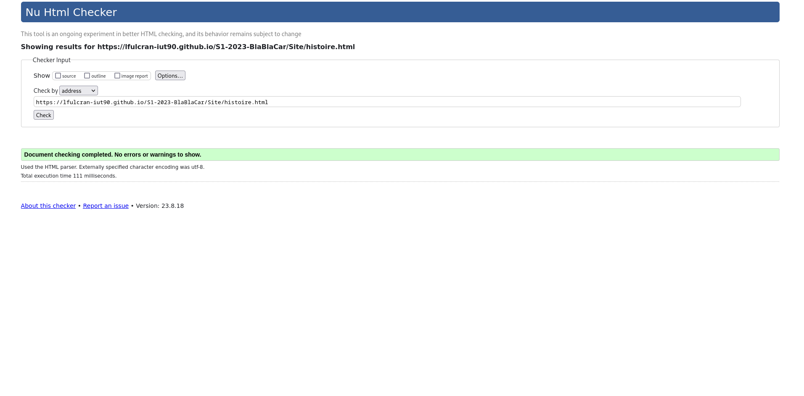

# S1-2023-IHM - SAE 1.05-1.06

## BlabLaCar

[VroumVroumGo](https://lfulcran-iut90.github.io/S1-2023-BlaBlaCar/Site/index.html)

## Membres du groupe N°10 :

- [MERAT Leslie](mailto:leslie.merat@edu.univ-fcomte.fr?subject=SAE_1_05_06) (référente du groupe)
- [FROEHLY Jean-Baptiste](mailto:jean-baptiste.froehly@edu.univ-fcomte.fr?subject=SAE_1_05_06)
- [FULCRAND Lucas](mailto:lucas.fulcrand@edu.univ-fcomte.fr?subject=SAE_1_05_06)
- [FUMEY JEANJEAN Axel](mailto:axel.fumey@edu.univ-fcomte.fr?subject=SAE_1_05_06)

## Présentation 

Ce dépôt correspond à un site web créé en HTML/CSS/JS dans le cadre de la SAÉ 05-06 à l'IUT de Belfort-Montbéliard. Ce site présente des informations concernant l'entreprise BlaBlaCar et sert de vitrine pour présenter l'entreprise, ses activité, son organisation et son historique. Vous trouverez dans ce dépôt et sur le site un rapport économique analysant l'aspect économique de BlaBlaCar.

## Choix de conception  

Pour la conception du site, nous nous sommes grandement inspirés du site officiel de BlaBlaCar (disponible [ici](https://www.blablacar.fr/)), une template sur CodePen, "Bistro café délices" ([aperçu](https://www.bistrocafedelices.com)) pour la sobriété et l'élégence (boutons et images de fond) et nous avons pris comme référence la charte de "ROSA", une template également sur CodePen disponible [ici](https://codepen.io/Sir_thirrygolooo/pen/PoXKOrE).

## Développement Site Web et Validation des pages

### Page d'acceuil

**Auteur : FROEHLY Jean-Baptiste**

[Vérification W3C](https://validator.w3.org/nu/?doc=https%3A%2F%2Flfulcran-iut90.github.io%2FS1-2023-BlaBlaCar%2FSite%2Findex.html)

***

### Services

**Auteur : FULCRAND Lucas**

[Vérification W3C](https://validator.w3.org/nu/?doc=https%3A%2F%2Flfulcran-iut90.github.io%2FS1-2023-BlaBlaCar%2FSite%2Fservices.html)

***

### Histoire

**Auteur : MERAT Leslie**

[Vérification W3C](https://validator.w3.org/nu/?doc=https%3A%2F%2Flfulcran-iut90.github.io%2FS1-2023-BlaBlaCar%2FSite%2Fhistoire.html)

***

### Statistiques

**Auteur : FUMEY JEANJEAN Axel**

[Vérification W3C](https://validator.w3.org/nu/?doc=https%3A%2F%2Flfulcran-iut90.github.io%2FS1-2023-BlaBlaCar%2FSite%2Fstatistiques.html)

***

### Économie

**Auteur : FROEHLY Jean-Baptiste**

[Vérification W3C](https://validator.w3.org/nu/?doc=https%3A%2F%2Flfulcran-iut90.github.io%2FS1-2023-BlaBlaCar%2FSite%2Feconomie.html)

## Répartition du travail

### Planification - Diagramme de GANTT

- MERAT Leslie

***

### Recherches d'informations

- MERAT Leslie
- FROEHLY Jean-Baptiste
- FULCRAND Lucas
- FUMEY JEANJEAN Axel

***

### Rapport économique

- MERAT Leslie
- FROEHLY Jean-Baptiste
- FULCRAND Lucas
- FUMEY JEANJEAN Axel

***

### Développement site

**FROEHLY Jean-Baptiste**
  - Page d’accueil
  - Page économie
  - Navbar et Footer

**FULCRAND Lucas**
  - Page services
  
**MERAT Leslie**
  - Page histoire
  
**FUMEY JEANJEAN Axel**
  - Page statistiques
